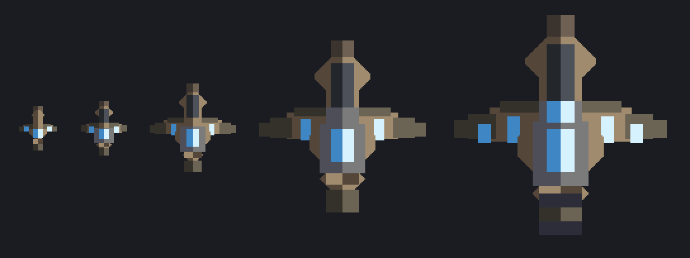
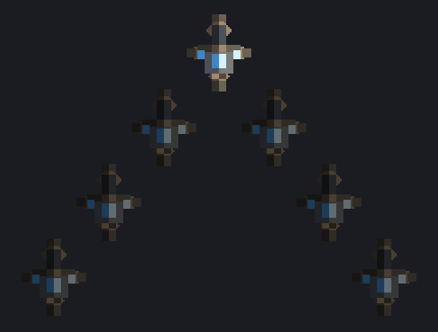
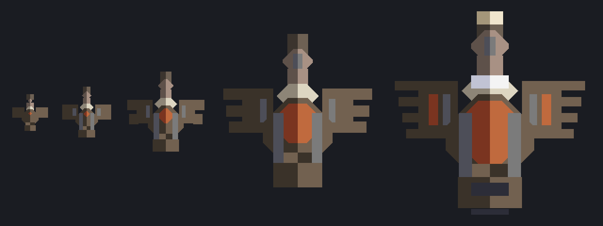
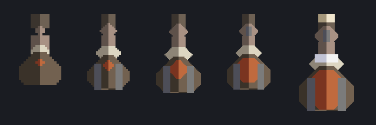
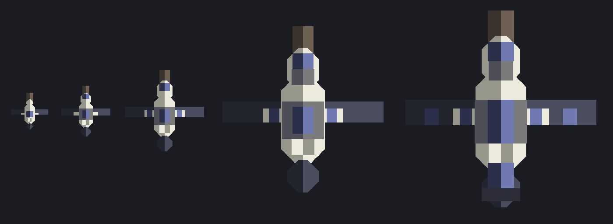
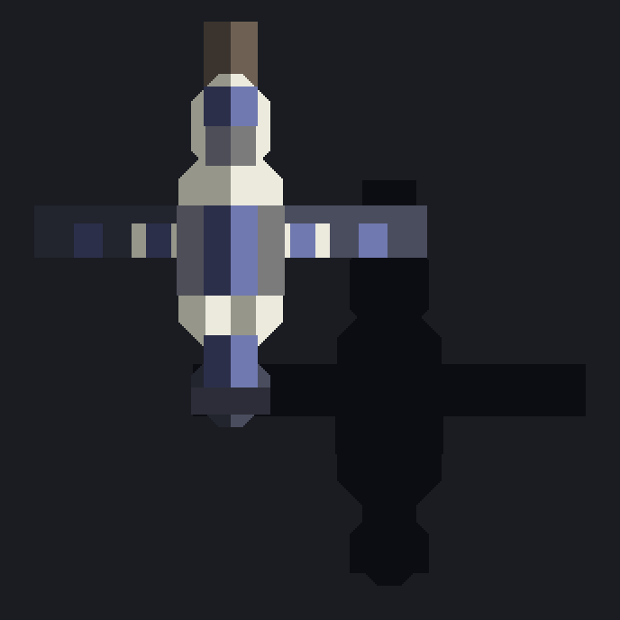
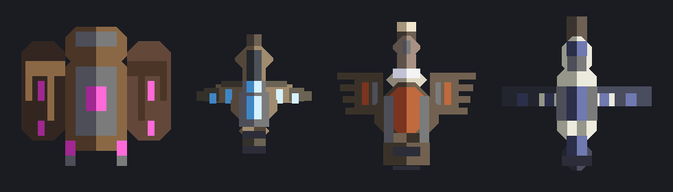

# A second air family: three candidates, drawn

The Stoop is the only thing in the sky and it is a **bomber**: it picks a
structure inside its seek reach, leaves the route, dives it and goes off
on contact (`payload`, `game/levels.ts`; the dive is in `Sim` beside the
Tusker's charge). Everything about how that family is answered follows
from it — a stoop that dies anywhere at all has **spent itself**, so a
wall of flak on the outer ring is a complete answer, and the family never
really tests the line behind it. The apex is the clearest case: the
stoop5 is the widest, softest body in the game and its whole job is to
reach one building and take twenty-four blocks of board with it.

This is the sheet for the opposite promise. **A second air family that
does not spend itself**: it crosses the board over the guns, it does not
stop for a turret, and it arrives at the core and works on it. That makes
one question the whole design —

> **Why does it survive the crossing?**

— because "it flies, so it ignores the maze" is not a gimmick, it is what
`flying: true` already does, and a family whose only idea is that would be
a Stoop that forgot to explode. Three animals below, three answers, one
sheet each. Nothing here is wired into the game: the drawings are
`game/skyConceptArt.ts`, rendered by `npm run gen:air`, and there are no
kind ids, no cells in `atlas.ts` and no stats in `levels.ts` behind them.

All three obey the brief and the house rules the same way:

- **No payload.** No dive, no fuse, no contact charge. It flies the air
  field to the core, holds at the core's edge and fires (`Sim`, the flyer
  branch), exactly as a flyer with no `payload` already does.
- **It is answered by REACH, not by position.** Nothing about any of
  these cares where the wall is.
- **One animal, five tiers, one gimmick** — `docs/unit-art.md` section 1,
  unchanged — and the gimmick is in the drawing wherever it can be.
- **A name that is a flight word and not a proper noun**, the way the bat
  is a *Stoop*: a **skein** is a flight of geese, a **kettle** a wheeling
  flock of vultures, a **gyre** the ocean wind an albatross rides.

A word on what they cost in the deal: `AIR_FAMILIES` derives itself from
`flying`, so a second air family lands in `openingDeal` for free and is
never dealt one of the opening's ring positions. What it does change is
that a four-family roll can now come up **two flyers**, and a board that
has bought no sky reach by wave 12 meets both. That is a real balance
event and not a bug — but it is the reason to pick the candidate whose
answer is a turret a player would want anyway.

---

## 1. Skein — the goose. *The flock is one body.*



**The gimmick: only the point bird can be hit.** Geese fly in a V and
here the V is real — every bird behind the point sits in its draft, and
while it is there nothing on the board can touch it: not a shot, not a
splash, not a status. The guns get the point and nothing else. Kill it
and the left wing bird takes the point, the wedge closes up, and the
board starts again on a fresh full-health body.



*Seven runts in the wedge: the one the board can shoot, and the six it
cannot.*

**Why it crosses the line.** Every other wave in the game is a POOL of
health that the board's total damage per second drains. A skein is a
QUEUE, and a queue is a clock: the crossing takes however long it takes to
kill *n* birds one at a time, and no amount of splash, flak or chip
damage shortens it. The airburst — the game's standard answer to air —
does almost nothing here, because what it is good at is hitting six
things at once and five of them are not there. What kills a skein is
**high damage per shot on a target that keeps changing**, which is the
railhead, the piercer and the coil, and a board that has not bought one
of those watches the queue arrive on schedule.

**The counterplay is real and it is not "more DPS".** The draft only
holds while a bird is inside `slot` tiles of the one in front of it, so
anything that moves a leader out of line — a repeater's knockback, a
douser's soak, a tether — **breaks the wedge open and exposes the ones
behind it**. That is the family's whole skill expression, and it is a use
for two turrets nobody currently builds for the sky.

**In the drawing.** The frost at the wing root is the **draft cell**: the
point bird burns it and the wedge behind rides what comes off it. On the
field the point's cell is lit and the rest are dark, which is how a player
reads, at a glance, which body their guns are actually on.

**What it would take.** A `wedge?: { slot, lead, haste, max }` on
`UnitStats`; a per-unit "in draft" flag and a chain; two filters, one in
target selection and one in splash application; and the promotion when the
point dies. `max` caps a wedge at about eight birds, so a hundred-goose
wave is a dozen wedges and not one queue of a hundred — a single
unbreakable line of a hundred bodies is not a mechanic, it is a wall with
a timer. **Medium cost, and one genuine risk**: an untargetable body is
the most annoying thing a tower defence can show you, so the lit point and
the break-the-line counter are not polish, they are the design.

Boxes: 1.125 / 1.375 / 2.25 / 4.375 / 5.625 — leaner than the Stoop at
every rung, because this family's weight is in how many are in the wedge
and not in any one body.

---

## 2. Kettle — the vulture. *Your kills feed it.*



**The gimmick: it eats the dead.** A kettle carries no charge and barely
a weapon. What it does is circle, and every body that dies inside its
reach — the swarm's own, and it does not care whose — is carrion: a share
of that body's health goes onto the kettle's, permanently, and the crop
at its breast swells with it.



*The gimmick IS the silhouette: the sac from a runt's two units to an
apex's full breast.*

**Why it crosses the line.** Because the line built it. A board that
shreds a ground wave under a kettle has fed the thing that is going to
reach its core; a board that turns its guns up at the kettles first lets
the ground wave in. That is not a damage problem, it is a **tempo
problem**, and it is the only one on the roster that gets worse the better
you are doing. It also gives *where* you kill things a meaning it has
never had here — a body that dies out past the kettles' reach is a body
they do not get — so it rewards a deep line over a tight one, which is
the opposite of what every other family rewards.

**It is self-limiting by construction**, which is what makes it safe: a
kettle wave feeds on its own dead too, so the numbers scale with the wave
rather than with the player's DPS alone, and the cap is a flat multiple
of the body's own health.

**What it would take.** A `carrion?: { share, range, max }` on
`UnitStats` and a hook where a unit already dies: find the kettles in
range, add `share` of the dead body's max hp, clamp at `max`. The growth
shows as a draw scale on the quad and the crop cell brightening.
**Lowest cost of the three by a wide margin** — no targeting change, no
new render path, no second position. If the answer to "which of these
ships first" is decided on engineering, it is this one.

Boxes: 1.25 / 1.75 / 2.75 / 5.25 / 6.75, inside the Stoop's 7.25 — the
thing that grows at the table should not start at the ceiling.

**The one problem, said plainly: the palette.** The crop's rust sits
between the Ironhides' rose and the Grapnels' copper, and `PAL`'s rule is
one hue a family with no two neighbours on the wheel. What is actually
free for a ninth family is the cold end — a frost and a near-black — so if
this is the one that ships, the crop has to move onto the frost seat and
be lit rather than red. Better said here than found on the field.

---

## 3. Gyre — the albatross. *You shoot the shadow.*



**The gimmick: the bird is not the target.** A gyre soars above every
gun's arc and nothing on the board can touch it. What the board *can*
touch is the **shadow it casts** — cast down and forward of the wings by
a fixed sun, sliding across the ground ahead of it. The shadow is the
hitbox. Damage to the shadow is damage to the bird.



*The sprite and its hitbox, at the offset the sun puts between them.*

**Why it crosses the line.** Two reasons, and the second is the
interesting one. First, every gun's reach is now measured to a point that
is not where the bird is, so a turret that looks like it covers the
approach may cover none of it. Second — **a shadow only exists on lit
ground**. Where it crosses a wall, a cliff or the dark side of a rock mass
there is no shadow and there is nothing to shoot, so the map's own terrain
becomes cover *for the enemy*, and a gyre that threads the rock arrives
untouched. That is the sharpest idea on this sheet: the one family that
supposedly ignores the terrain is the only one that reads it.

**In the drawing.** The family's colour is the shadow's — a cold
near-black on the keel, at the wing root and out along the apex's hand.
The needle wing is a quarter of the bat's chord, which makes it the one
body on the sheet that is a LINE; against a fingered vulture and a swept
goose, none of the three is ever mistaken for another at field zoom.

**What it would take, honestly: the most of the three, by a lot.** A
`ceiling?: { lead, side }` is the easy part. The hard part is that every
place the sim reads a unit's position *for combat* — target selection,
range checks, bullet collision, splash, every aura — has to read a second
point instead, and the renderer needs a shadow pass. Add the terrain
lookup for whether the shadow is on lit ground and this is a **targeting
refactor with a family attached**, not a stats edit with a drawing.

It is also the one most likely to feel unfair rather than clever: a player
whose guns are shooting empty air three tiles off the sprite needs to be
*told* why, in the art, every frame. The shadow being drawn solid and
black with no lighting in it at all is the beginning of that answer and
probably not the whole of it.

Boxes: 1.375 / 1.875 / 3 / 6.125 / 7.25 — the apex ties the stoop5 for the
widest in the game, which on the one family you cannot shoot is the right
kind of joke: it is enormous, and its size buys the board nothing.

---

## Beside the family they would fly with



*Left to right: stoop5 (7.25 blocks), skein5 (5.625), kettle5 (6.75),
gyre5 (7.25) — every one at native size, 32 px a tile, so the comparison
is a measurement and not a claim.*

Note what the three have that the Stoop does not: **a body that runs the
length of the box with the wings out either side of the middle of it.**
The bat's wing is nearly twice as deep as it is long, which is right for a
bat and wrong for every bird — the first four passes of these drawings
filled the box with body and hung a deep slab off each side, and every one
of them came out a bottle with wings. A wing that reads as a wing on this
grid has a chord of about six units of the 32 layout and a span of half
the box, and the layouts in `skyConceptArt.ts` are built around leaving
room for exactly that.

---

## The recommendation

**Ship the Skein.** It is the only one of the three whose answer to "why
does it survive the crossing" is a *clock the board cannot shorten*, which
is precisely the threat the Stoop does not pose, and it changes what a
player buys rather than where they put it — a board that has bought
single-target sky reach beats it and a board that has bought flak does
not. It is also the one whose counterplay already exists in the catalogue:
knockback and soak break a wedge open, and neither turret is currently
bought for the sky by anybody.

**Keep the Kettle as the second pick and the cheap one.** If the schedule
matters more than the shape of the threat, it is a death hook and a draw
scale, and "your own kills feed the air wave" is the most novel sentence
on this page. Fix its hue first.

**Hold the Gyre.** It is the best idea here and the worst thing to build
next: a displaced hitbox touches every combat path in the sim, and the
failure mode — guns visibly missing a sprite — is the kind a player calls
a bug rather than a mechanic. It is the right family for the version of
this game that has already wanted a second hitbox for something else.

## What was passed on, and why

- **A carrier that ferries ground bodies over the maze and drops them
  behind the line.** Answers the brief perfectly and is the least
  original thing in the genre; every game with air transports has it.
- **A flyer that lands on a turret and takes it over.** Turns the air
  family into a turret-interaction family, and the brief is that this one
  goes for the core.
- **A flyer that stores the damage it takes and delivers it to the core.**
  The decision it wants from the player — stop shooting that one — is a
  decision this game cannot offer: turrets pick their own targets, so what
  reads at the table as a dilemma reads on the field as a punishment for
  owning guns.
- **A flock that shares damage evenly across every body in it.** The
  Skein without the queue: it changes the arithmetic and not the play,
  because the total health is the same and the board does the same thing
  to it.

## Taking one further

`docs/unit-art.md` section 3 is the checklist. These sheets are step 1 —
the T5 drawn first and the T1 scaled down from the same layout — and the
next steps are unchanged: draw the parts the wing rig packs (there are
`<candidate>-body.png` and `<candidate>-wing.png` in `docs/air-concepts/`
already), declare the cells in `atlas.ts`, pack through `packWinged`, give
it stats and a `FAMILY_NAMES` entry, and **check it in the built game and
not in the preview** — the preview cannot show the wingbeat, and the beat
is where a wing's chord goes wrong.

```
npm run gen:air        # re-render every sheet here
SCALE=4 npm run gen:air # bigger, for looking at the pixels
ALL=1 npm run gen:air   # every run under four px, not the first eight
```
